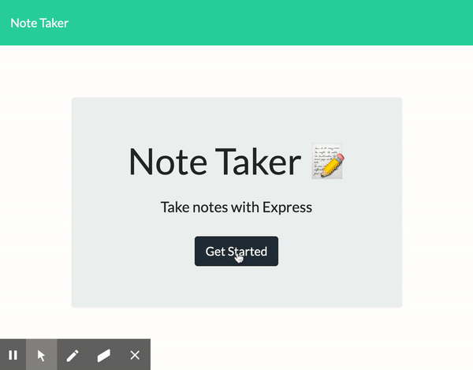

# Note-Taker

Created by [BMcCorm](https://github.com/BMcCorm)

## Table of Contents

- [Description](#Description)
- [Installation](#Installation)
- [Usage](#Usage)
- [Contributing](#Contributors)
- [Testing](#Testing)
- [License](#License)
- [Questions](#Questions)

## Description

This application allows the user to write, save and delete notes. It uses express to save and retrieve note data from a JSON file.

## Installation

This user-friendly interface does not require installation. It's hosted on Heroku and can be found [here.](https://note-taker-bm.herokuapp.com/)

## Usage

Once on the homepage, click on "get started." The user is directed to the notes page, where new messages can be entered and deleted. Simply add your note and hit the save icon. Once the note is no longer needed, click the accompanying trash icon to delete it.     

## Interested in contributing? Here's how:

1. Fork this repository
2. Create a branch: git checkout -b "create_a_branch_name"
3. Make and commit your changes: git commit -m "add your message here"
4. Push to the master branch: git push origin "branch_name"
5. Create the pull request

Additional information on creating a pull request can be found [here](https://help.github.com/en/github/collaborating-with-issues-and-pull-requests/creating-a-pull-request).

## Contributors

No contributors at this time.

## Testing

No testing at this time.

## License

No license at this time.

## Questions

For more information, please email me at BrielleMcCormick@gmail.com  
The GitHub link for this project can be found [here](https://BMcCorm.github.io/Note-Taker/).
